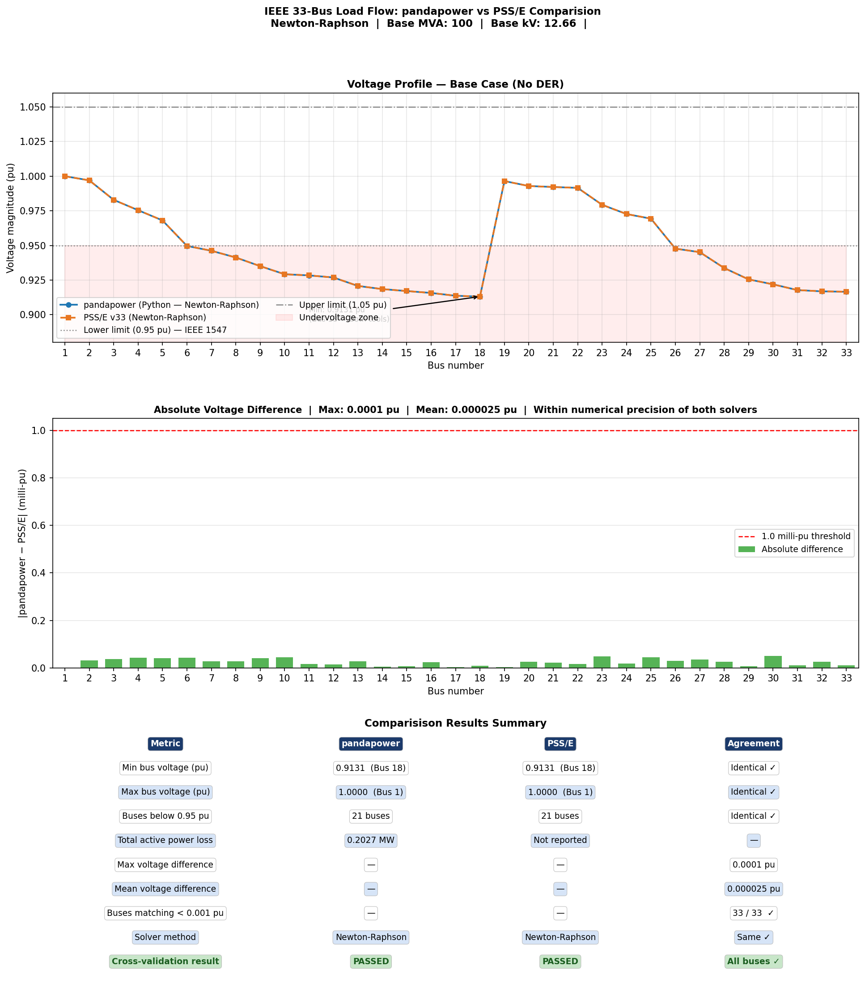

# DER Load Flow Analysis — IEEE 33-Bus Distribution System

Load flow and 24-hour quasi-static time-series simulation of a radial distribution
network with integrated PV generation, Battery Energy Storage (BESS), and EV
charging, implemented in Python using pandapower. Results are compared against
PSS/E — all 33 buses agree within 0.0001 pu.

---

## Key Results

### Base Case Load Flow

| Metric | pandapower | PSS/E v33 |
|---|---|---|
| Min bus voltage (pu) | 0.9131 (Bus 18) | 0.9131 (Bus 18) |
| Max bus voltage (pu) | 1.0000 (Bus 1) | 1.0000 (Bus 1) |
| Buses below 0.95 pu | 21 | 21 |
| Total active power loss (MW) | 0.2027 | — |
| Max difference between tools | — | 0.0001 pu ✓ |

> **Comparison result:** pandapower and PSS/E produce identical load flow
> results for the IEEE 33-bus system. Maximum voltage difference across all 33 buses
> is **0.0001 pu** — within numerical precision of both Newton-Raphson solvers.

### DER Integration (PV + BESS + EV)

| Metric | Base Case | With DER |
|---|---|---|
| Min bus voltage (pu) | 0.9131 (Bus 18) | 0.9405 (Bus 29) |
| Buses below 0.95 pu | 21 | 6 |
| Voltage improvement | — | +2.74 % |
| Reduction in violations | — | 71 % |

---

## Plots

### Voltage profile: base case vs DER integration


### 24-hour bus voltage envelope


### DER dispatch and BESS state of charge


### Hourly active power losses


### Voltage violation count per hour


### pandapower vs PSS/E v33 cross-validation


---

## Network & DER Configuration

**Test system:** IEEE 33-bus radial distribution network (Baran & Wu)
**Base voltage:** 12.66 kV
**Total base load:** 3.715 MW + j2.300 MVAr

| Asset | Bus | Rating | Basis for bus selection |
|---|---|---|---|
| PV Unit 1 | 14 | 2.0 MW peak | Lowest voltage in base case |
| PV Unit 2 | 31 | 2.0 MW peak | Second weakest bus |
| BESS | 31 | 0.5 MW / 2.0 MWh | Co-located with PV for loss reduction |
| EV Charging | 28 | 1.5 MW peak | Mid-feeder representative node |

**BESS rule-based dispatch strategy :**
- Charge when PV output > 30 % of rated and SOC < 90 % (hours 06:00–15:00)
- Discharge during evening demand peak and SOC > 20 % (hours 18:00–22:00)
- Efficiency: 95 %

---

## Comparison Methodology

The base case load flow was independently solved in two tools:

| Tool | Type | Solver | Language |
|---|---|---|---|
| pandapower | Newton-Raphson | Python 3 |
| PSS/E | Newton-Raphson | - |

Both tools used identical network data:
- Same bus topology (IEEE 33-bus)
- Same impedance values (per unit on 100 MVA, 12.66 kV base)
- Same load data (32 constant-power loads)
- Same slack bus (Bus 1)

**Result:** All 33 buses match within 0.0001 pu — confirming that the pandapower
model is correctly implemented and suitable for DER integration studies.

---

## Project Structure

```
der_load_flow_IEEE33bus/
├── src/
│   ├── main.py                       #  runs full simulation
│   ├── network.py                    # Network builder and DER asset creation
│   ├── simulation.py                 # Load flow, BESS dispatch, time-series loop
│   ├── plots.py                      # All visualisation functions
│   └── compare_psse_pandapower.py    # PSS/E vs pandapower comparisonn
├── results/                          # Generated plots and CSV 
│   ├── 01_voltage_profile_comparison.png
│   ├── 02_timeseries_voltage.png
│   ├── 03_der_dispatch_and_soc.png
│   ├── 04_power_losses.png
│   ├── 05_voltage_violations.png
│   ├── 06_comparison.png
│   └── timeseries_results.csv
├── psse/
│   └── IEEE33bus.sav                 # PSS/E v33 saved case file
├── requirements.txt
└── README.md
```

---

## How to Run

```bash
# 1. Install dependencies
pip install -r requirements.txt

# 2. Run the full DER simulation (generates plots 01-05 and CSV)
python src/main.py

# 3. Run the PSS/E cross-validation comparison (generates plot 06)
python src/compare_psse_pandapower.py
```

All plots are saved to `results/` automatically.

---

## Background

This project is part of my broader research on DER-integrated microgrids, which includes MPC-based power management and hybrid energy storage systems. Related
publications:

- **Jena, C.J., Ray, P.K.** — *Power Quality Enhancement and Power Management of PV-HESS Based Grid-Tied Microgrid Using Model Predictive Control*,
  IEEE Transactions on Industry Applications, 2024.
- **Jena, C.J., Ray, P.K.** — *Power Allocation Scheme for Grid-Interactive Microgrid with Hybrid Energy Storage System Using Model Predictive Control*,
  Journal of Energy Storage, 2024.
- **Jena, C.J., Ray, P.K.** — *Power Management in Three-Phase Grid-Integrated PV System with Hybrid Energy Storage System*, Energies (MDPI), 2023.

---

## Tools

Python · pandapower · NumPy · pandas · matplotlib · PSS/E

---

## Reference

Baran, M.E. and Wu, F.F. (1989) *Network reconfiguration in distribution systems
for loss reduction and load balancing*, IEEE Transactions on Power Delivery, 4(2),
pp. 1401–1407.

---

## License

MIT
