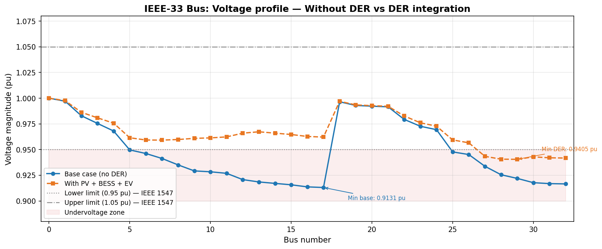
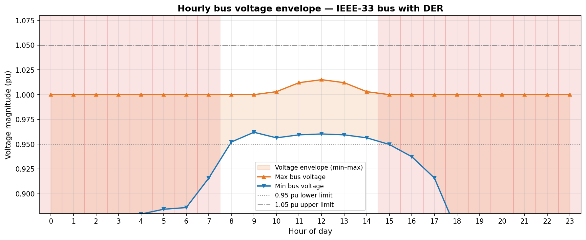
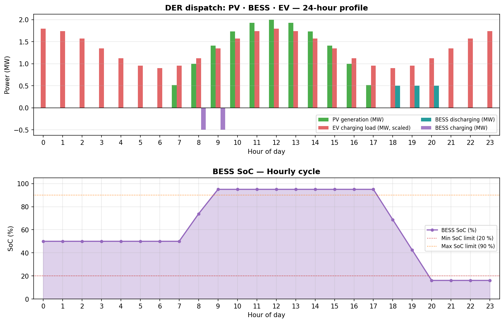
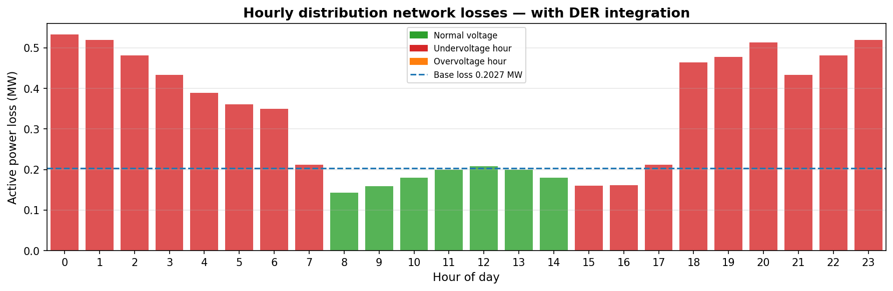
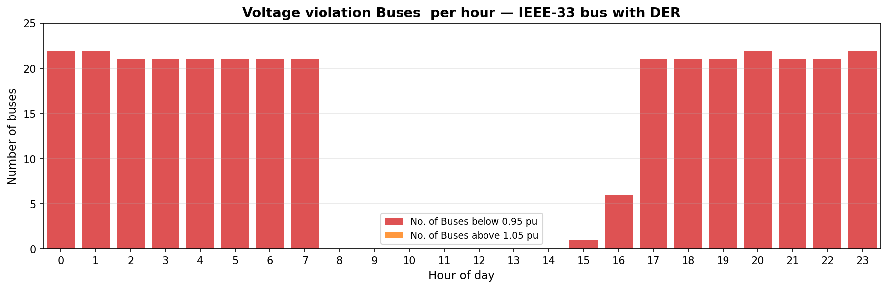

<<<<<<< HEAD
# DER Load Flow Analysis — IEEE 33-Bus Distribution System
Load flow study of a radial distribution network with integrated PV generation, Battery Energy Storage (BESS), and EV charging implemented in Python using pandapower.

---

## Key Results

| Metric | Base case | With PV + BESS + EV |
|---|---|---|
| Min bus voltage (pu) | 0.9131 (Bus 17) | 0.9405 (Bus 29) |
| Buses below 0.95 pu | 21 | 6 |
| Total active power loss (MW) | 0.2027 | 0.1423 (min, hour 8) |
| Voltage improvement | — | +2.74 % |

> PV & BESS integration reduced the number of buses violating the IEEE 1547 standard.
> voltage lower limit from **21 to 6** — a **71 % reduction** — and improved
> minimum bus voltage by **2.74 %**.

---

## Plots

### Voltage profile: Without DER vs DER integrated


### One day bus voltage Profile


### DER dispatch and BESS SoC


### Hourly active power losses


### Voltage violation count per hour


---

## Network & DER Configuration

**Test system:** IEEE-33 bus radial distribution network.  
**Base voltage:** 12.66 kV  
**Total base load:** 3.715 MW + j2.300 MVAr  

| Asset | Bus | Rating | Basis for bus selection |
|---|---|---|---|
| PV Unit 1 | 14 | 2.0 MW peak | Lowest voltage in base case (end of longest feeder) |
| PV Unit 2 | 31 | 2.0 MW peak | Second weakest bus (tail of second lateral) |
| BESS | 31 | 0.5 MW / 2.0 MWh | Co-located with PV for loss reduction |
| EV Charging | 28 | 1.5 MW peak | Mid-feeder representative node |

**BESS dispatch strategy (rule-based):**
- Charge when PV output > 30 % of rated and SOC < 90 % (hours 06:00–15:00)
- Discharge during evening demand peak and SOC > 20 % (hours 18:00–22:00)
- Round-trip efficiency: 95 %

---

## Project Structure

```
der_load_flow_IEEE33bus/
├── src/
│   ├── main.py          # Entry point — runs full simulation
│   ├── network.py       # Network builder and DER asset creation
│   ├── simulation.py    # Load flow, BESS dispatch, time-series loop
│   └── plots.py         # All visualisation functions
├── results/             # Generated plots and CSV (auto-created on run)
├── requirements.txt
└── README.md
```

---

## How to Run

```bash
# 1. Install dependencies
pip install -r requirements.txt

# 2. Run the simulation
python src/main.py
```

All plots are saved to `results/` and a full time-series CSV is exported to
`results/timeseries_results.csv`.

---

## Background

This project is part of my broader research on DER-integrated microgrids, which
includes MPC-based power management and hybrid energy storage systems. 

My publications:

- **Jena, C.J., Ray, P.K.** — *Power Quality Enhancement and Power Management of
  PV-HESS Based Grid-Tied Microgrid Using Model Predictive Control*, IEEE
  Transactions on Industry Applications, 2024.
- **Jena, C.J., Ray, P.K.** — *Power Allocation Scheme for Grid-Interactive
  Microgrid with Hybrid Energy Storage System Using Model Predictive Control*,
  Journal of Energy Storage, 2024.

---

## Tools

Python · pandapower · NumPy · pandas · matplotlib

---

## License

MIT
=======
>>>>>>> ab12d6877561254b99920857d37c71b40f4e6cee
